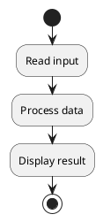
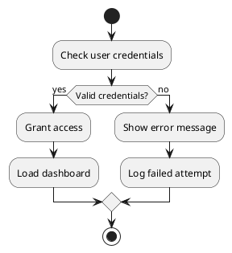
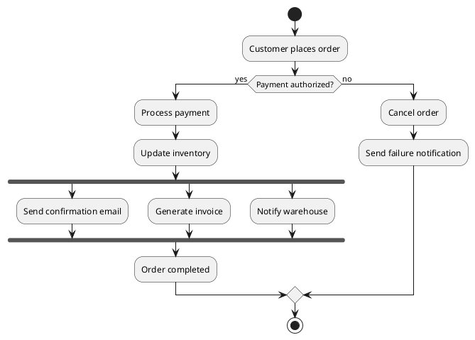
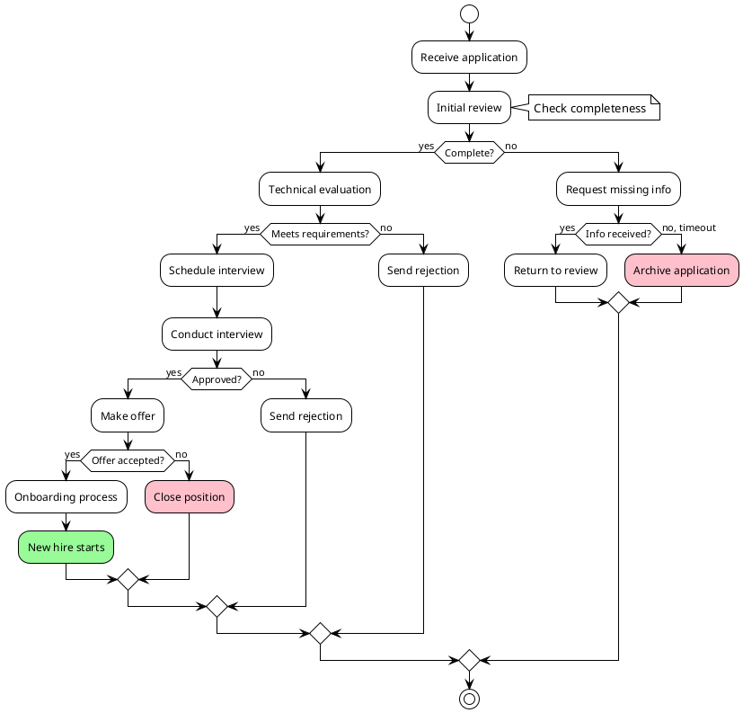
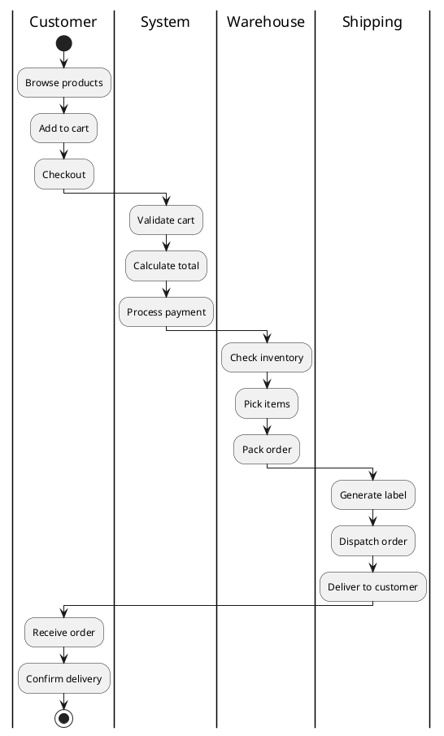
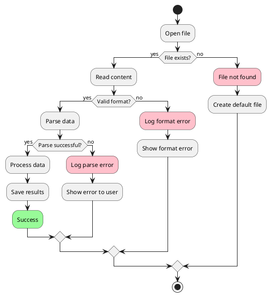
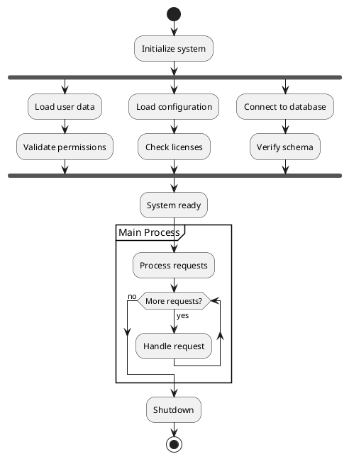

Activity diagrams show the flow of control or data through a system. They're great for documenting business processes and algorithms.

## Basic Flow

## Conditional Flow

## Order Processing Workflow

## Complex Business Process

## Swimlane Activity Diagram

## Error Handling Flow

## Parallel Processing

## Best Practices

1. **Use colors**: Highlight important states with colors
2. **Add notes**: Provide context for complex decisions
3. **Use swimlanes**: Show responsibility across different actors
4. **Keep it simple**: Don't overcomplicate with too many branches
5. **Label decisions clearly**: Make yes/no paths obvious