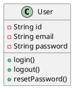
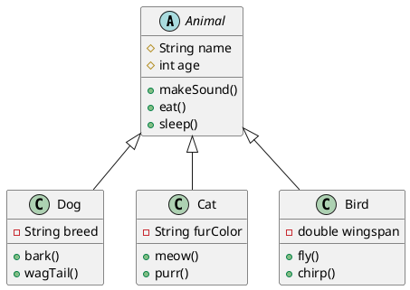
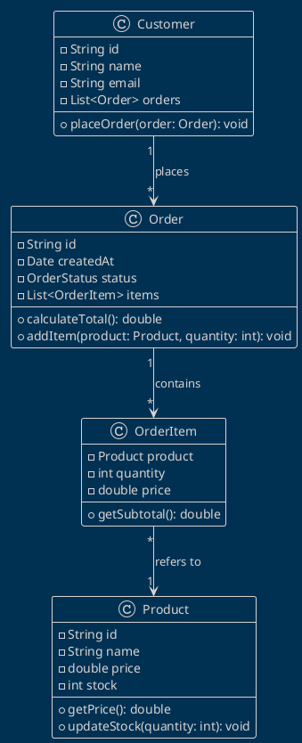
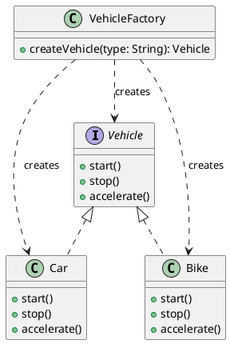
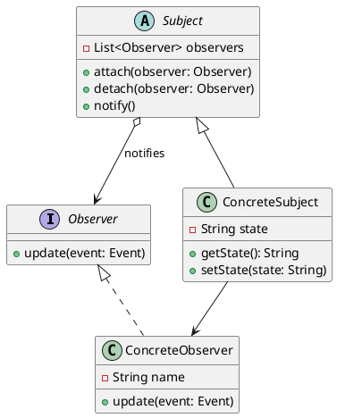
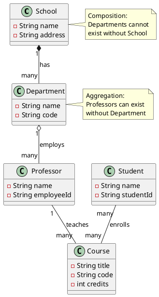

Class diagrams show the structure of a system by depicting classes, their attributes, methods, and relationships.

## Basic Class

## Inheritance Example

## E-commerce System

## Design Patterns

### Factory Pattern

### Observer Pattern

## Advanced Relationships

## Visibility Modifiers

- `+` Public
- `-` Private
- `#` Protected
- `~` Package/Internal

## Relationship Types

- `--|>` Inheritance
- `..|>` Interface implementation
- `--` Association
- `-->` Directed association
- `o--` Aggregation
- `*--` Composition
- `..>` Dependency