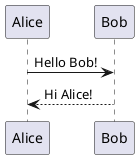
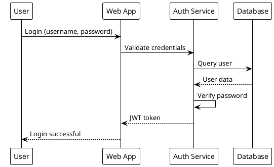
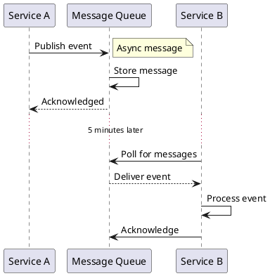
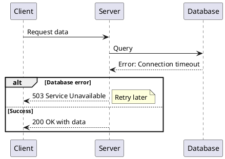
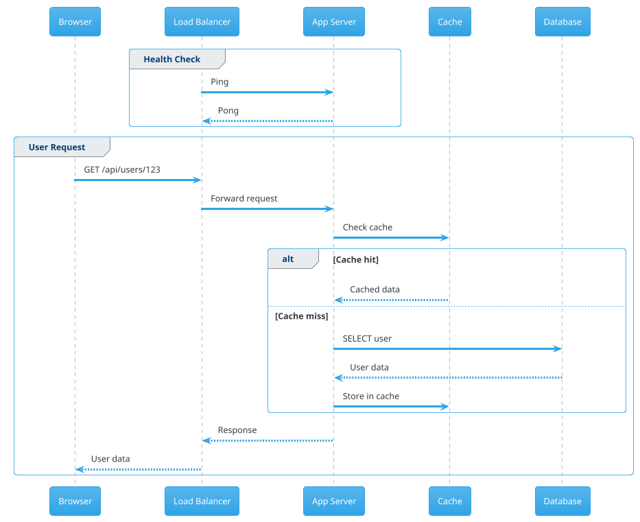

Sequence diagrams show interactions between participants over time. They're perfect for documenting APIs, user flows, and system interactions.

## Basic Sequence Diagram

## Authentication Flow

## Async Communication

## Error Handling

## Complex Flow with Groups

## Tips for Sequence Diagrams

1. **Use meaningful names**: Instead of `A`, `B`, use `Client`, `Server`
2. **Add notes**: Use `note left/right` to add context
3. **Show timing**: Use `...` to indicate time passing
4. **Group related interactions**: Use `group` blocks
5. **Handle conditions**: Use `alt/else` for different flows