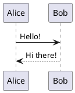

import { Card, CardGrid } from '@astrojs/starlight/components';

## Features

<CardGrid stagger>
  <Card title="Automatic Conversion" icon="pencil">
    Automatically converts PlantUML code blocks in markdown files to images during build time.
  </Card>
  <Card title="Multiple Diagram Types" icon="seti:notebook">
    Supports sequence, class, activity, state, component diagrams, mind maps, and Gantt charts.
  </Card>
  <Card title="Customizable" icon="setting">
    Configure server URL, timeout, CSS classes, and more to fit your needs.
  </Card>
  <Card title="Error Handling" icon="warning">
    Graceful error handling with fallback to show the original code if rendering fails.
  </Card>
</CardGrid>

## Quick Example

Write PlantUML in your markdown:

````markdown

````

And it automatically renders as:


## Why Astro PlantUML?

- **📝 Write Once**: Keep your diagrams as code in version control
- **🚀 Fast Builds**: Diagrams are rendered at build time, not runtime
- **🎨 Themeable**: Use PlantUML themes to match your site's design
- **🔧 Flexible**: Use the public server or host your own
- **✨ Simple**: Just write PlantUML code blocks - no manual exports needed