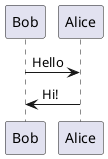

## Prerequisites

- An Astro project (v3.0 or higher)
- Node.js 18 or higher

## Installation

Install the `astro-plantuml` package:

```bash
npm install astro-plantuml
```

Or with other package managers:

```bash
# yarn
yarn add astro-plantuml

# pnpm
pnpm add astro-plantuml
```

## Basic Setup

Add the integration to your `astro.config.mjs`:

```js
import { defineConfig } from 'astro/config';
import plantuml from 'astro-plantuml';

export default defineConfig({
  integrations: [plantuml()],
});
```

That's it! You can now use PlantUML code blocks in your markdown files.

## Test Your Installation

Create a markdown file with a PlantUML code block:

```markdown
# Test Page

Here's a simple diagram:


```

Run your Astro dev server:

```bash
npm run dev
```

You should see your PlantUML diagram rendered as an image!

## Next Steps

- Learn about [configuration options](/configuration/)
- See more [examples](/examples/)
- Set up a [custom PlantUML server](/configuration/#custom-server)